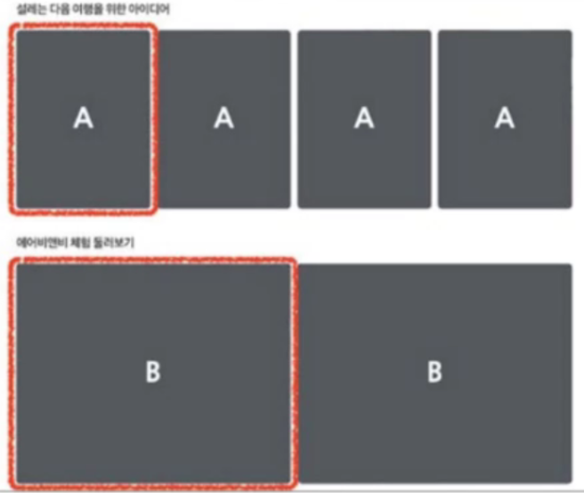

# 박찬민 202030214

* [1주차](#36-강의)
* [2주차](#313-강의)
* [3주차](#320-강의)
* [4주차](#327-강의)
* [5주차](#43-강의)
* [8주차](#58-강의)
* [9주차](#522-강의)
---
## 5/22 강의
### 리스트와 키란 무엇인가?
* 리스트는 자바스크립트의 변순 객체를 하나의 변수로 묶어놓은 배열과 같은 것입니다.
* 키는 각 객체나 아이템을 구분할 수 있는 고유한 값을 의미합니다.
* 리액트에서는 배열과 키를 사용하는 반복되는 다수의 엘리먼트를 쉽게 렌더링 할 수 있습니다.
### 여러 개의 컴포넌트 렌더링 하기
* 예의 에어비엔비의 화면처럼 같은 컴포넌트를 화면에 반복적으로 나타내야 할 경우 배열에 들어있는 엘리먼트를 map() 함수를 이용하여 렌더링 합니다.


### 리스트의 키
* 리스트에서 아이템을 구분하기 위한 고유한 문자열
* 리스트에서 어떤 아이템이 변경, 추가 또는 제거되었는지 구분하기 위해 사용
* 리액트에서는 키의 값은 같은 리스트에 있는 엘리먼트 사이에서만 고유한 값이면 됨
---
## 5/8 강의
### 함수형에서 이벤트 핸들러를 정의하는 방법
- 함수형에서 this 를 사용하지 않고,
onClick 에서 바로 HandleClick 을 넘기면 됩니다.
### Arguments
* 함수를 정의할 때는 파라미터(Parameter)혹은 매개변수,
* 함수를 사용할 때는 아귀먼트(Argument)혹은 인수 라고 부릅니다.
* 이벤트 핸들러에 매개변수를 전달해야 하는 경우도 많습니다.
* event 라는 매개변수는 리액트의 이벤트 객체를 의미합니다.
### 조건부 렌더링이란?
```jsx
function Greeting(props) {
    const isLoggedIn = props.isLoggedIn;
    if (isloggedIn) {
        return <UserGreeting />;
    }
    return <GuestGreeting />;
}
```
### 엘리번트 변수
- 렌더링해야 될 컴포넌트를 변수처럼 사용하는 방법이 엘리먼트 변수 입니다.

### 인라인 조건
#### 필요한 곳에 조건문을 직접 넣어 사용하는 방법
1. 인라인 if
    - if 문을 직접 사용하지 않고, 동일한 효과를 내기 위해 && 논리 연산자를 사용합니다.
    - && 는 and 연자로 모든 조건이 참일때만 참이 됩니다.
    - 첫 번 조건이 거짓이면 두번째 조건은 판단할 필요가 없습니다. (=단축평가)
   ```jsx
    {unreadMessages.length > 0 &&
        <h2>
            현재 {unreadMessages.length}개의 읽지 않은 메시지가 있습니다.
        <h2>
    }
   ```
   판단만 하지 않는 것이고 결과값은 그대로 리턴 됩니다.
2. 인라인 if-else
   - 삼항 연산자를 사용합니다.
   - 문자열이나 엘리먼트를 넣어서 사용할 수도 있습니다.

---
## 4/3 강의
### props 란?
prop(property: 속성, 특성)의 준말로 컴포넌트의 속성입니다. 컴포넌트에 전달 할 다양한 정보를 담고 있는 자바스크립트 객체입니다.
어떤 props 를 넣느냐에 따라 다른 엘리먼트가 출력됩니다.

### props 의 특징
1. 읽기 전용입니다. 변경할 수 없다는 의미
2. 속성이 다른 엘리먼트를 생성하려면 새로운 props 를 컴포넌트에 전달하면 됩니다.

### Pure 함수 vs. Impure 함수
* Pure 함수는 인수로 받은 정보가 함수 내부에서도 ***변하지 않는 함수*** 입니다.
* Impure 함수는 인수로 받은 정보가 함수 내부에서 ***변하는 함수*** 입니다.

### Props 사용법
* jsx 에서는 key-value 쌍으로 props 를 구성합니다.
```jsx
function App(props) {
    return (
        <Profile
            name="소플"
            introduction="안녕하세요, 소플입니다."
            viewCount={1500}
            />
    );
}
```
위의 코드는
1. App 컴포넌트에서 props 를 인자로 받아
2. 내부의 Profile 컴포넌트로 전달해서 name, introduction, viewCountdp 각각 속성을 할당
3. 이때 전달되는 props는 다음과 같은 자바스크립트 객체입니다.

```jsx
{
    return(
        <Profile
        name="소플"
        introduction="안녕하세요, 소플입니다."
        viewCount={1500}
        />
    );
}

```

아래 코드처럼 props를 통해서 value를 할당 할 수도 있고, ***직접 중괄호를 사용***하여 할당할 수도 있습니다.
```jsx
function App(props) {
    return (
        <Layout
            width={2560}
            height={1440}
            header={
                <Header title="소플의 블로그입니다." />
            }
            footer={
                <Footer />
            }
        />
    );
}
```
### 컴포넌트의 종류
* 리액트 초기 버전을 사용할 때는 클래스형 컴포넌트를 주로 사용
* 이후 Hook이라는 개념이 나오면서 최근에는 함수형 컴포넌트를 주로 사용
* 예전에 작성된 코드나 문서들이 클래스형 컴포넌트를 사용하고 있기 때문에,
* 클래스형 컴포넌트와 컴포넌트의 생명 주기에 관해서도 공부해 두어야 합니다.
---
## 3/27 강의

---
## 3/20 강의

### React란?
* 사용자 인터페이스를 만들기 위한 자바스크립트 라이브러리

### React 장점
1. 빠른 업데이트와 렌더링 속도
2. 컴포넌트 기반 구조
3. 재사용성
---
## 3/13 강의
## GitHub 사용법
[git 설명서](https://git-scm.com/book/ko/v2)
### ✔ Git 초기화 (저장소 만들기)
``` git init ```
### ✔ Git 연동 방법
``` 
git config --config user.name "example" 
git config --config user.email "example@example.com" 
```

### ✔ Git 연동 확인
```
git config user.name
git config user.email
```
---
## 3/6 강의
# H1
## H2
### H3
#### H4
##### H5
###### H6

Test line

#### list
1. 1st
2. 2st
3. 3st

* 순서 없는 리스트
* Test

```js
let myHeading = document.querySelector("h1");
myHeading.textContent = "Hello world!";
```

---
*test*  
**test**  
***test***

[구글](http://google.com)   
[문서내 링크](#list)

